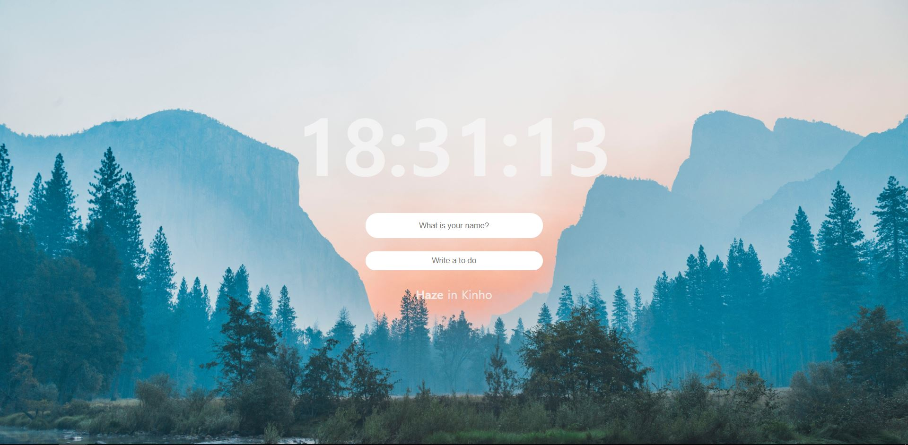
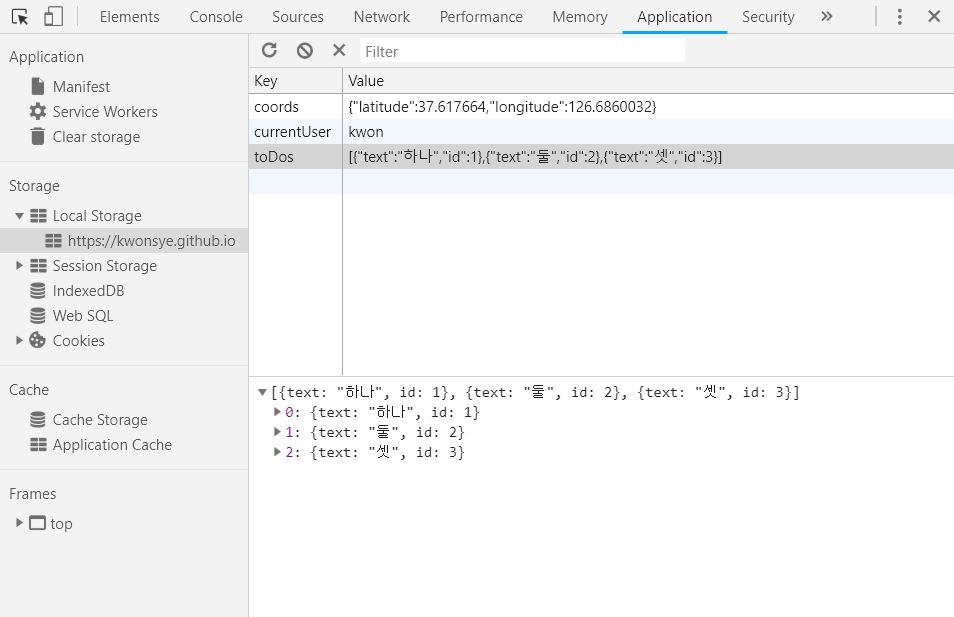
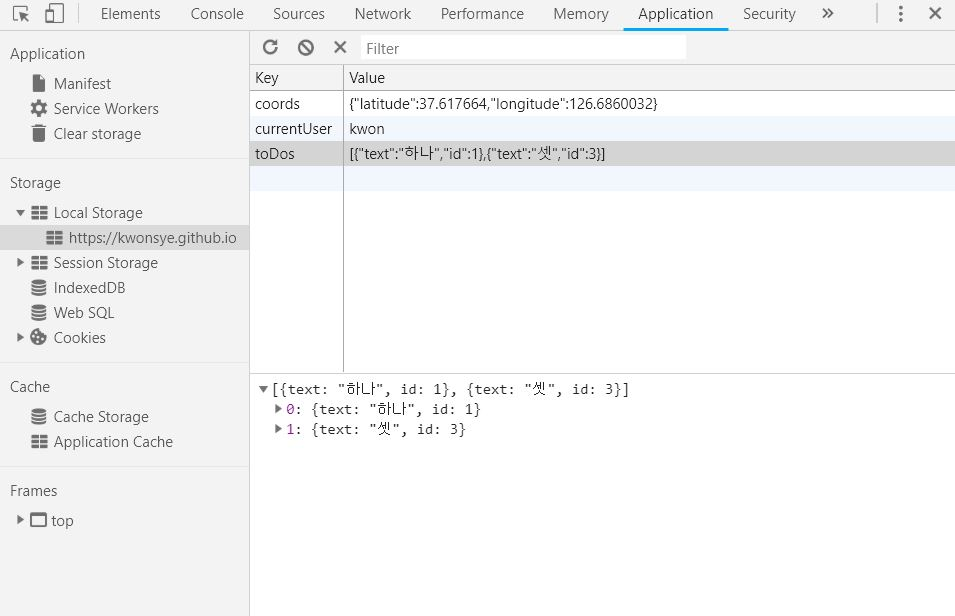
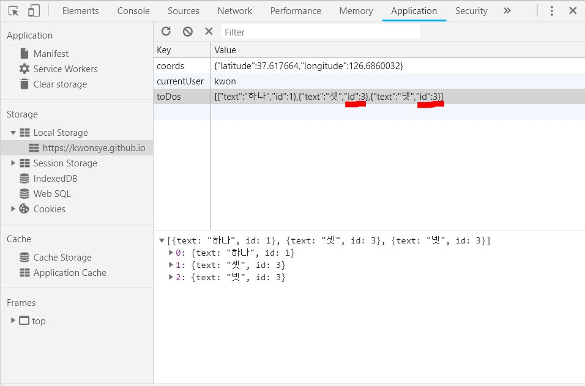
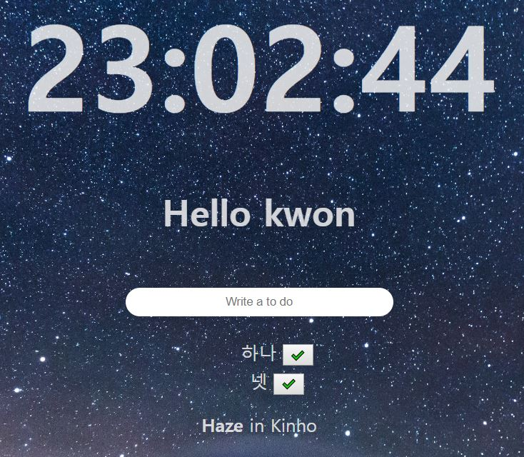
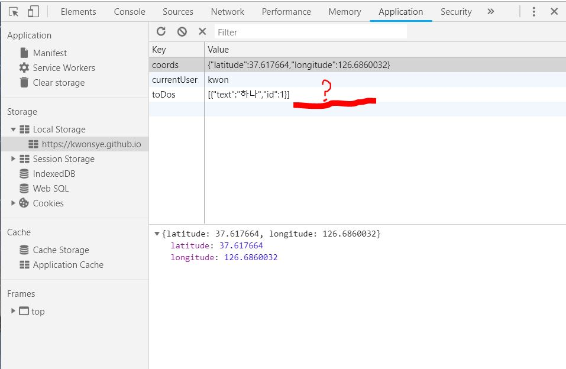

# clock_and_todoList_app

<https://kwonsye.github.io/clock_and_todoList_app>

- html, css, vanilla javascript 사용
* 초기 화면



* 이름과 todo 입력 후 화면


- `clock.js` : clock기능
    - `getTime()` : `new Date()`로 현재 시, 분, 초를 가져와서 2초마다 `innerText` 설정
- `gretting.js` : User Name 입력 및 greeting message 기능 
    - `loadName()` : localStorage에 `USER_LS` 가 존재하는지 확인
    - `askForName()` : 사용자에게 이름을 입력받은 후 `handleSubmit()` 호출
    - `handleSubmit()` : 사용자가 입력한 이름을 페이지에 print, localStorage에 저장
    - `paintGreeting()` : form element를 hide, greeting element를 show

- `todo.js` :  ToDos 추가 및 삭제 기능
    - `loadTodos()` : localStorage의 `TODOS_LS`를 가져와서 보여줌
    - `paintToDo()` : `TODOS_LS`에 저장되어 있는 todo 들을 각각 `li` element로 생성, Object로 만든 후 배열에 저장 -> localStorage에 저장
    - `handleSubmit()` : `todo form` 에 입력한 todo를 가져와서 `paintToDo()` 로 그려줌
    - `deleteToDo()` : 삭제 버튼을 누르면 해당 todo의 `li` element 삭제, `.filter()`로 todo배열 update

- `weather.js` : 사용자 위치 저장 및 weather API 사용 기능(날씨, 온도, 위치)
    - `loadCoords()` : localStorage에서 `COORDS`가져온다.
    - `askForCoords()` : 사용자의 위치정보를 가져온다.
    - `handleGeoSuccess()` : 사용자의 lat,long 을 Object로 만든 후 localStorage에 저장
    -  `getWeather()` : weather api fetch 후, 해당 lat,long의 temp,place,weather를 페이지에 보여준다.

- `background.js` : 배경 이미지 random 기능
    - `getRandom()` : 배경 이미지 index을 random으로 반환
    - `paintImage()` : 해당 index의 사진을 가져와서 `img` element로 만든 후 `body` 에 붙여줌

- `index.css` 에서 사용한 기능
    - `.show` : `element.classList.add(show)`를 통해 원하는 element에 해당 style을 적용시킨다. (이 경우 `display:none` 이었던 element를 보이게 하는 기능)


## 버그 발견

- `todo.js` 에서 발생한 문제
1. todo 3개 입력


2. 두 번째 todo 삭제


3. 네 번째 todo 입력


4. 세 번째 todo 삭제 후 웹페이지의 todo 상태 (새로고침 전)


5. 세 번째 todo 삭제 후 localStorage : 삭제가 발생한 id를 가진 todo가 모두 삭제되었음


6. 새로고침 후의 웹페이지 todo 상태 : todo-list를 localStorage에서 load해오므로 당연한 결과..
    


- 문제의 원인 :  
`const newID = toDos.length+1;`
    - 현재 배열의 길이대로 id를 부여했기 때문에 todo를 삭제할 경우 중복 id를 가진 todo가 생길 수 있다. -> localStorage에서 같은 id의 JSON이 함께 지워지는 버그 생김

- 문제를 해결한 idea
    - 새롭게 입력한 todo를 localStorage에 저장할 때  기존 todo-list에 저장된 todo들 가운데 maximum한 ID를 가지고 와서 그것보다 +1인 ID를 부여해주자 !
    ```
    //todos 중 maxID를 찾아서 리턴해주는 함수
    function findTodosMaxID(){
    let maxID = 0; //var보단 let을 쓰자!
    toDos.forEach((todo) => {
        if(maxID <= todo.id){
            maxID = todo.id;
        }
    })
        return maxID;
    }
    const maxID = findTodosMaxID();
    const newID = maxID + 1;

    ```


