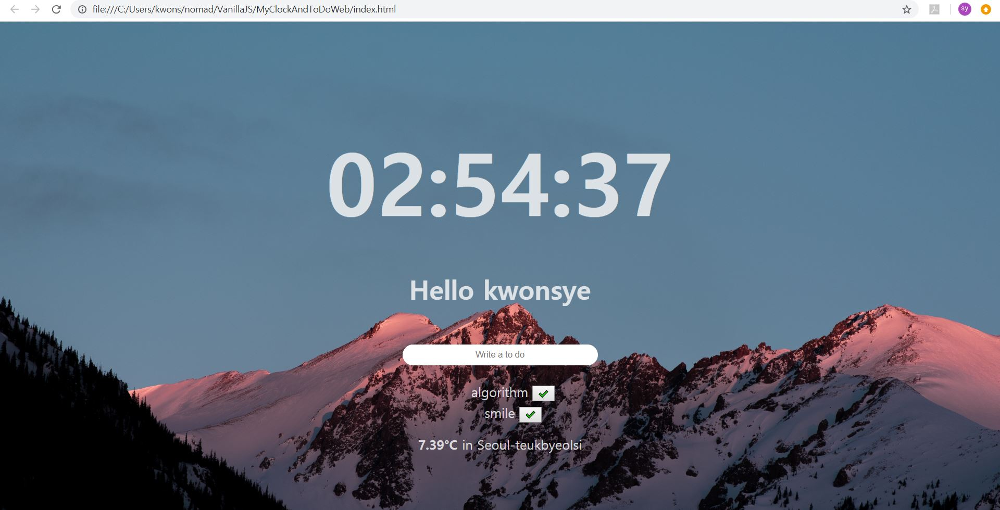

# MyClockAndToDoWeb
ToDo 웹페이지 스크린샷 이미지

javascript

1. Clock 기능 => clock.js
2. User Name 입력 및 greeting message 기능 => gretting.js
3. ToDos 추가 및 삭제 기능 => todo.js
4. 사용자 위치 저장 및 weather API 사용 기능(날씨, 온도, 위치) => weather.js
5. 배경이미지 random 기능 => background.js

index.css

index.html
